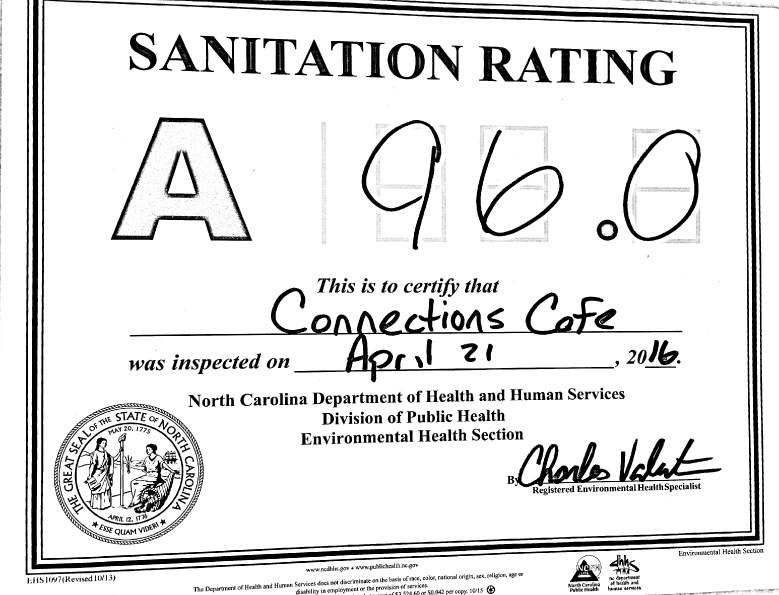
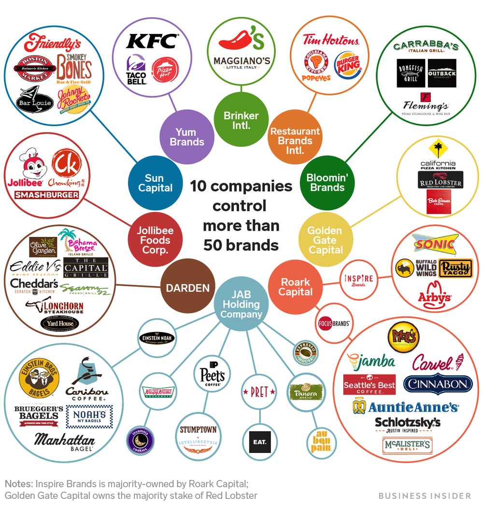

<!-- README.md is generated from README.Rmd. Please edit that file -->

# STA 323 & 523 :: Homework 04

## Introduction

<center>



</center>

Restaurants are subject to routine and follow-up inspections. As part of
these inspections, a score is generated that encapsulates the
cleanliness of the restaurant. A score of 100 is the best. Wake County
makes this data publicly available and partners with Yelp as a
participant in Yelp’s LIVES program. You can read more about Yelp’s
program [here](https://www.yelp.com/healthscores).

## Data

The data in `data/` is from [Wake County Open
Data](https://data-wake.opendata.arcgis.com). There are two shapefiles
in that folder. They are boundary files that correspond to the Wake
County line and zip codes. The `restaurants.rds` file contains
information on inspections, violations, and the location of restaurants
in Wake County. This was put together using the three “Restaurant -
Yelp” datasets on the Open Data site.

Get started by reading in each of the shapefiles with the following
code.

``` r
wake <- st_read("data/Wake_County_Line.shp", quiet = TRUE)
zips <- st_read("data/Zip_Codes.shp", quiet = TRUE)
restaurants <- read_rds("data/restaurants.rds")
```

Do not make any assumptions about the data. There are many recording
inconsistencies. You should use regular expressions where applicable to
account for as many of the recording variations as possible.

For the purposes of this assignment, you may assume all the restaurants
in the dataset are still in business.

## Tasks

All visualizations should include the Wake County line layer and the
Wake County Zips layer. Please have a consistent theme in your
visualizations and avoid sticking with the default labels and colors.
You may generate your visualizations using `ggplot`, `leaflet`, or
`mapview`. It is okay to use `ggplot` for one task and `leaflet` for
another.

Continue to use branches as you did in Homework 03.

You may use packages outside of those in your starter Rmd file.

#### Task 1

Check that the CRS is the same for all three `sf` objects. If not, put
them all on `NAD83 / North Carolina (ftUS)`.

#### Task 2

Do some basic cleaning of your `sf` objects. Ensure the variable names
follow a consistent style. For `restaurants`, remove any rows with
missing scores or empty geometries. Doing other manipulations here, such
as fixing the date or converting variables to different type, may make
things easier for you in the later tasks.

Once you are satisfied with your manipulations, overwrite the original
objects. Please explain or justify any non-obvious cleaning choices.

#### Task 3

Create side-by-side maps showing the locations of routine inspections in
Wake County. One plot should show the routine inspections for April
2019, the other plot for April 2020. Describe what you observe in 2-3
sentences.

#### Task 4

Create a choropleth map showing the number of restaurant inspections by
zip code since 2018 in Wake County. Zip codes with 0 inspections should
not be a part of your continuous color palette (you may choose the color
for these zips). Also, do not stick with the default fill colors. In at
most five sentences, explain what this map is not accounting for in the
data.

#### Task 5

Compute the average inspection score within 1, 2, and 5 miles from the
geographic center of Wake County. Only consider the most recent routine
inspection for each restaurant since 2019.

#### Task 6

Chicken wars\! Define Chick-fil-A’s turf as the interior of one mile
outside the convex hull of its restaurants in Wake County. Are any
Zaxby’s restaurants outside of Chick-fil-A’s turf? If so, which
stores? You may answer this question by producing a table or by
providing a clear visualization showing the restaurants, convex hull,
and one mile buffer. Give a 1-2 sentence answer to the questions.

#### Task 7

<center>



</center>

Does competition result in cleanliness and higher scores? To answer this
question with some anecdotal evidence, choose two competing restaurants
or companies and evaluate their scores when they are close or far from
each other. It will be best to look at chains that have multiple stores
spread out in Wake County. You can also look at competing companies and
a subset of their restaurant holdings. Your answer may include a table,
visualization or both. Please also provide a short summary of your
findings and what you defined as “close”.

Do not use any of the stores that were closely analyzed in previous
tasks.

## Essential details

### Deadline and submission

**The deadline to submit Homework 04 is Monday, March 8 at 11:59pm ET.**
Only your final commit and code in the main branch will be graded.

### Help

  - Post your questions in the \#hw4 channel on Slack. Explain your
    error / problem in as much detail as possible or give a reproducible
    example that generates the same error. Make use of the code snippet
    option available in Slack. You may also send a direct message to the
    instructor or TAs.

  - Visit the instructor or TAs in Zoom office hours.

  - The instructor and TAs will not answer any questions about this
    assignment within three hours of the deadline.

### Academic integrity

This is a team assignment. You may communicate with other teams in the
course. As a reminder, any code you use directly or as inspiration must
be cited.

To uphold the Duke Community Standard:

  - I will not lie, cheat, or steal in my academic endeavors;
  - I will conduct myself honorably in all my endeavors; and
  - I will act if the Standard is compromised.

Duke University is a community dedicated to scholarship, leadership, and
service and to the principles of honesty, fairness, respect, and
accountability. Citizens of this community commit to reflect upon and
uphold these principles in all academic and non-academic endeavors, and
to protect and promote a culture of integrity. Cheating on exams and
quizzes, plagiarism on homework assignments and projects, lying about an
illness or absence and other forms of academic dishonesty are a breach
of trust with classmates and faculty, violate the Duke Community
Standard, and will not be tolerated. Such incidences will result in a 0
grade for all parties involved as well as being reported to the
University Judicial Board. Additionally, there may be penalties to your
final class grade. Please review Duke’s Standards of Conduct.

### Grading

| **Topic**                              | **Points** |
| -------------------------------------- | ---------: |
| Task 1                                 |          1 |
| Task 2                                 |          2 |
| Task 3                                 |          3 |
| Task 4                                 |          4 |
| Task 5                                 |          4 |
| Task 6                                 |          5 |
| Task 7                                 |          6 |
| Made use of branches and pull requests |          2 |
| Code style and format                  |          3 |
| **Total**                              |     **30** |

*Documents that fail to knit after minimal intervention will receive a
0*.
